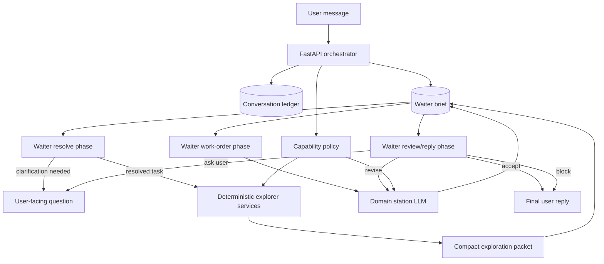

# First-Principles Redesign Notes

This is a forward-looking design note, not a description of the current
implementation. It captures what we would build differently if we restarted the
analytics agent architecture from first principles after learning from the
waiter/kitchen prototype.

## Core Direction

Keep the broad idea of a user-facing coordinator plus domain workers, but move
more control into deterministic application code.

The app should own:

- state transitions
- session identity
- capability policy
- persistence
- user-facing message boundaries
- retry/rework rules
- artifact routing

LLMs should own:

- intent interpretation
- search-term expansion
- synthesis
- domain reasoning
- final response writing, after validation

## Proposed Shape



## Main Changes

### 1. The App Is The Orchestrator

Do not let a waiter LLM own the overall state machine. The app should
deterministically execute:

```text
intake -> resolve intent -> explore -> station -> review -> user reply
```

The LLM can produce structured decisions inside each phase, but code decides the
phase, session, allowed tools, and user-visible output.

This avoids leakage such as internal station orders, preflight summaries, or
headless-routing text reaching users.

### 2. Waiter Owns The End-To-End Experience

Do not split intent resolution and answer review into independent owners. The
waiter should remain responsible for the whole user experience:

- understand what the user actually wants
- decide what context must be gathered
- translate the request into station work
- judge whether station output satisfies the original intent
- write the user-facing final response or follow-up question

The implementation should still use phase-specific calls, prompts, and schemas:

- `waiter.resolve`: current user message plus waiter brief -> resolved task,
  clarification question, rejection, or exploration request.
- `waiter.order`: waiter brief plus exploration packet -> station work order.
- `waiter.review`: waiter brief plus station output -> final reply, follow-up
  question, one revision request, or blocker.

These are phases of one waiter, not separate agents with separate ownership.
This keeps final judgment anchored to the original user intent without loading a
single giant waiter context forever.

The durable handoff object is a **Waiter Brief**:

```json
{
  "userIntent": "What the user actually wants",
  "successCriteria": ["What must be true for the answer to be good"],
  "knownContext": ["Relevant user, project, and conversation facts"],
  "constraints": ["Auth, source, tool, mutation, and form-factor limits"],
  "openQuestions": [],
  "workOrder": {},
  "reviewFocus": ["What the waiter should scrutinize before replying"]
}
```

The review phase receives the waiter brief, station result, compact evidence,
artifacts, and blockers. It does not need the full raw transcript or every tool
call unless the app detects a dispute, rework, or audit need.

### 3. Explorer As Search Service, Not Freeform Agent

The explorer should be primarily deterministic services:

- `kb.search`
- `kb.read`
- `manifest.search`
- `model.details`
- `bq.profile_column`
- `bq.validate_query`
- `metabase.search`
- `slack.search`
- `drive.search`
- `repo.search`

An LLM may decide which searches to run and summarize the result, but broad
exploration should not be an unconstrained task loop. The output should be a
compact exploration packet with evidence, candidates, gaps, and confidence.

#### Source Decision Flow

Treat explorer as a shared research service, not a domain agent. The caller owns
the research agenda:

- **Waiter initiates preflight exploration** because it owns user intent,
  ambiguity handling, and the question "what do I need to know before writing a
  station work order?"
- **Stations initiate in-work exploration** because they own domain execution
  and know which specific evidence is missing after attempting the work.
- **Explorer executes bounded requests** and can recommend a next source, but it
  should not silently broaden the search agenda unless the caller allowed that
  fallback.

The target contract is:

```json
{
  "objective": "What the caller needs to learn",
  "initialSources": ["manifest", "bigquery"],
  "allowedFallbackSources": ["kb"],
  "checks": [
    {
      "source": "manifest",
      "query": "PLAAS matter field",
      "rationale": "Find candidate dbt models and columns"
    }
  ],
  "fallbackPolicy": "recommend_only",
  "stopWhen": "Candidate source-of-truth models and validation gaps are clear"
}
```

Fallback policy should be explicit:

- `recommend_only`: explorer reports likely next sources but does not use them.
- `use_if_initial_empty`: explorer may use fallback sources only if initial
  sources return no useful evidence.
- `use_if_confidence_low`: explorer may use fallback sources when the initial
  result is weak after bounded search.

Source choice should be LLM-authored by waiter/station, with deterministic code
limited to policy enforcement: remove disallowed sources, cap breadth, apply
surface-specific auth rules, and reject mutating tools unless explicitly
enabled. Regex/source heuristics are acceptable only as a compatibility fallback
when no caller-authored plan exists.

Slack, Drive, repo, and Jira should remain optional rather than default. Use
them when the user explicitly asks for those sources, when the waiter/station
has a concrete reason to expect source-of-truth evidence there, or when canonical
KB/manifest/BigQuery/Metabase sources are insufficient and the fallback policy
permits broadening. Jira/repo are especially appropriate for `eng_history`,
shipped-change, PR, ticket, implementation, or API/code behavior questions.

### 4. Stations Only Do Domain Work

Stations should receive:

- resolved task
- compact exploration packet
- capability policy
- expected output schema
- previous work summary, when continuing

Stations should not redo broad intent discovery. If they need more context, they
should ask for typed exploration:

```json
{
  "need": "distinct_values",
  "source": "bigquery",
  "relation": "evenup-bi.dbt_prod.dim_employees_history",
  "columns": ["geo_country", "geo_state_province"]
}
```

### 5. Workflow Templates Vs Workflow Agents

Keep the distinction:

- User-authored skills are workflow templates.
- Repo-defined workflow agents are reviewed, deployed code.

Use workflow templates when the work is a station procedure: run known SQL,
write a report, create an artifact, follow a documentation pattern.

Use workflow agents when the work needs a state machine, exact trigger,
confirmation gates, permission escalation, repo mutation, Jira creation, branch
pushes, or PR creation.

Users should not author agents from the web app.

### 6. One Conversation Ledger

Every turn should persist a structured ledger:

- raw user message
- normalized turn type
- resolved task
- exploration packet
- station input
- station output
- reviewer output
- final user message
- artifacts
- usage and cost
- blockers and policy decisions

This ledger should be the source of truth for continuation, rework, debugging,
Slack/web parity, and production conversation replay by id.

### 7. Explicit Artifact And Attachment Manifests

Avoid relying on hidden local folders as the primary contract. Local files should
be cache/scratch only.

The app should register attachments and artifacts in explicit manifests and pass
stable handles to tools:

```json
{
  "artifactId": "art_...",
  "kind": "sql",
  "gcsUri": "gs://...",
  "localPath": "/tmp/...",
  "owner": "conversationId",
  "createdBy": "analytics_station"
}
```

### 8. Capability Policy By Run

Do not think in terms of "agent has tool X." Think in terms of capabilities
granted to a run:

- `read_company_context`
- `search_analytics_metadata`
- `run_safe_bigquery`
- `create_metabase_card`
- `read_user_oauth_sources`
- `write_artifact`
- `mutate_repo`
- `create_jira`

Capabilities should be assigned by the app based on form factor, auth state,
explicit user action, and route. Slack and web can share agents while receiving
different capability policies.

### 9. Auth Mode Is Deterministic

For BigQuery and other user-sensitive systems, credential choice should be code,
not agent discretion:

```text
try service account
if denied and user OAuth is available, retry as user
if denied, return a concrete blocker
```

This also makes it easier to explain why Slack and web have different access.

### 10. Live Evals Are First-Class, But Separate From Tests

Keep deterministic unit tests for contracts. Put live LLM evals in a separate
manual runner that:

- runs named scenarios
- captures final reply, trace, artifacts, and usage
- applies a rubric
- writes JSON/Markdown reports
- never runs in CI unless explicitly requested

The PLAAS caveat and employee-growth Metabase cases are examples of Codex-judged
live evals, not unit tests.

## What This Simplifies

This design makes the waiter less like an autonomous freeform loop and more like
one end-to-end owner invoked through structured phases inside an app-owned state
machine.

That preserves the useful parts:

- rich intent understanding
- flexible source selection
- end-to-end user-experience ownership
- domain-specialized stations
- high-quality final response writing

While making these parts deterministic:

- routing state
- user-facing output categories
- session naming
- permission gates
- persistence paths
- retries and rework
- artifact upload and discovery
