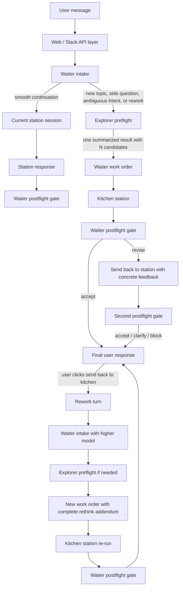
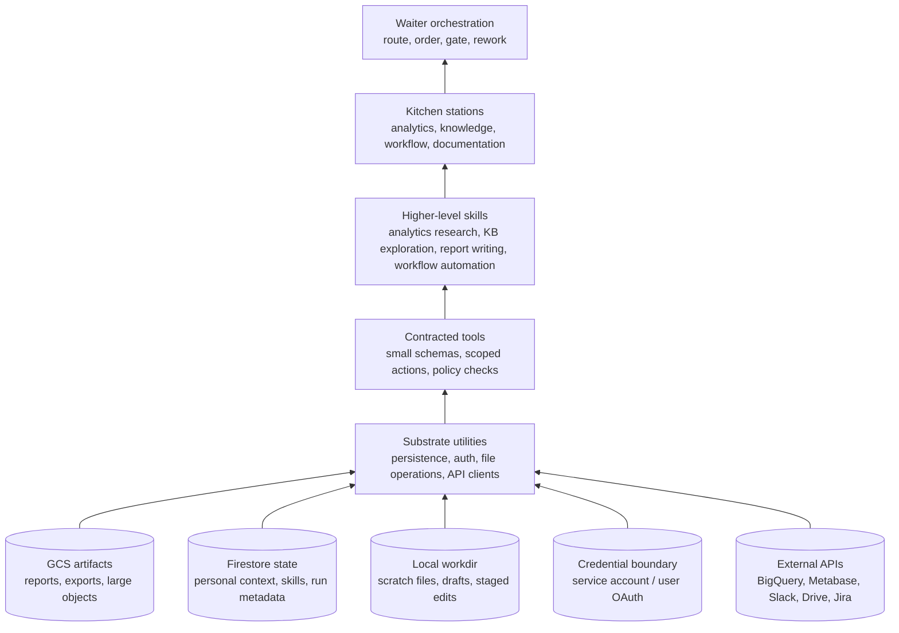
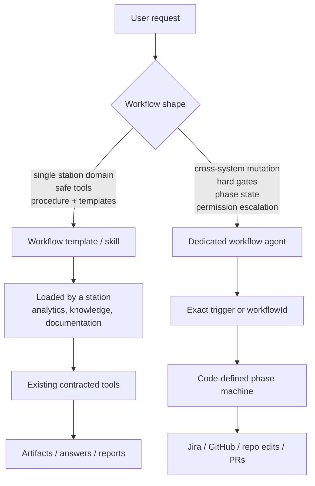

# Analytics Flue Agent

Local analytics self-serve agent for dbt manifest discovery, BigQuery exploration, and Metabase card workflows.

## Flow

The Flue agent is organized as a waiter-kitchen system:

- **Waiter** owns user experience, intent framing, routing, work-order creation, and postflight quality gates.
- **Explorer** is a cheap shared research utility. It gathers enough context for routing and planning, then returns one structured preflight result. The waiter receives a summarized version of that result, not an individual review per candidate.
- **Kitchen stations** do the actual domain work. Current stations cover analytics, knowledge, workflow, and documentation; analytics is the central station.
- **Postflight** is deterministic orchestration around an LLM gate: accept, revise once, clarify, or block.

The normal path is:

1. Waiter decides whether the message can continue an active station session or needs fresh preflight.
2. Explorer gathers bounded context from selected sources.
3. Waiter turns the summarized explorer result into one work order.
4. The selected kitchen station executes the work.
5. Waiter reviews the station delivery before writing the final response.

## Substrates And Skills

The agent separates durable infrastructure from domain skills. Substrate utilities
are small, policy-aware capabilities that know how to safely touch storage,
identity, local files, and external systems. Skills/toolsets compose those
substrates into work a domain station can reason about.



Conceptually:

- **Substrate utilities** should be boring and reusable. They handle storage,
  credentials, path safety, upload/download, query execution, and API mechanics.
- **Contracted tools** are the agent-facing surface over those utilities. They
  expose narrow schemas and enforce policy, so stations do not get raw filesystem
  or cloud access by default.
- **Higher-level skills** encode domain procedure: how to investigate a dbt
  model, how to validate a BigQuery assumption, how to create a Metabase card,
  how to search the knowledge base, or how to prepare an artifact.
- **Stations** load only the skills and tools needed for their job. The waiter
  does not need every tool; it mainly needs enough context to route and gate.

## Workflow Templates Vs Workflow Agents

Workflow is a user-facing concept. A user can experience both `/kpi drafts` and
`/pm-amplitude-event-creation` as workflows, but they should not necessarily be
implemented at the same layer.



Use a **workflow template / skill** when the workflow can be safely described as:

> Use this station's existing tools in this order, with these references,
> templates, caveats, and output expectations.

This is the right shape for analytics-specific workflows such as KPI reports:
fixed SQL templates, first-line investigation, HTML report generation, and GCS
artifact upload. It stays inside the analytics station and composes existing
safe tools.

Use a **dedicated workflow agent** when the workflow needs a state machine,
exact trigger protection, confirmation gates, permission escalation, or
cross-system mutation. Product-engineering automation such as
`pm-amplitude-event-creation` belongs here because it can clone repos, create
Jira tickets, edit code, push branches, and open PRs.

Personal context and personal skills follow the safer rule: **user-authored
skills can only be workflow templates**. They may teach a station a repeatable
procedure, preferred style, report format, investigation pattern, or domain
shortcut. They cannot define new Flue agents, new substrate utilities, new
credential access, or new mutating capabilities. Users cannot author agents
from within the web app; agents are repo-defined, reviewed, built, and deployed
outside the app. If a personal skill needs protected mutations, it should become
an admin-reviewed workflow agent or use an existing approved workflow agent.

## Skill Commands

Project skill invocation is deterministic:

```text
/{skill-directory-name} user instructions
```

The skill directory name is the skill id and trigger string. For example,
`/pm-amplitude-event-creation create tracking for task completion` invokes
`resources/skills/pm-amplitude-event-creation/SKILL.md`. Frontmatter trigger
aliases from migrated Claude skills are informational only and are not used for
dispatch.

## Send Back To Kitchen

When the user marks a response as not directionally correct, the API should send a rework turn instead of treating it as a normal continuation:

```json
{
  "message": "user's rework instruction",
  "rework": true,
  "priorAnswer": "the rejected answer",
  "waiterModel": "higher-capability waiter model"
}
```

If the caller does not pass `waiterModel`, the agent resolves rework turns with
`REWORK_WAITER_MODEL`, then `WAITER_ESCALATION_MODEL`, then `WAITER_MODEL`.

The rework contract is:

- Escalate the waiter model for that turn.
- Add a prompt addendum that forces a complete rethink of what the user is asking, rather than local edits to the prior answer.
- Run preflight again when the source choice, intent, or work order may have been wrong.
- Produce a new kitchen order that explicitly explains why the previous answer may have failed.
- Postflight the new station delivery before returning it to the user.

## Setup

```bash
cd examples/analytics
pnpm install
cp .env.example .env
cp .env.secrets.example .env.secrets
```

Put environment-specific, non-secret paths and defaults in `.env`; it is ignored
by git. `DBT_MANIFEST_PATH` should point to the local manifest file the tools
read. For local development this is usually
`/Users/billgu/Workspace/dbt/target/manifest.dbt_prod.json`; in GKE/prod it
should point to the container-local path where startup downloads the manifest
from GCS. Put provider keys and API tokens in `.env.secrets`; it is also ignored
by git.

The local dbt manifest can be compiled against a personal target schema such as
`dbt_bgu`. Before uploading it for the agent, run the local publish script; it
checks out `main`, pulls latest, compiles dbt, writes a normalized manifest with
EvenUp dbt schemas rewritten to `dbt_prod`, and uploads that normalized artifact
to GCS.

```bash
pnpm manifest:publish
```

By default this runs in `../../../dbt` relative to `examples/analytics`, reads
`target/manifest.json`, writes `target/manifest.dbt_prod.json`, and uploads to
`gs://$GCS_BUCKET/dbt-explorer/manifest/manifest.json`. Override with
`--dbt-dir`, `--schema`, or `--gcs-uri`.

The Python script locations default to:

- `resources/scripts/bq_explore/bq_explore.py`
- `resources/scripts/metabase/metabase-cli.py`

Override them with `BQ_EXPLORE_SCRIPT` and `METABASE_CLI_SCRIPT`.

Standalone analytics defaults to `openai/gpt-5.4`. Override it with `ANALYTICS_MODEL`.

Waiter-kitchen defaults:

- waiter: `anthropic/claude-opus-4-7`
- explorer: `openai/gpt-5.4-nano`
- kitchen/station: `openai/gpt-5.4`

Persistence defaults are aligned to `dbt-explorer-api` local dev:

- `GCP_PROJECT=evenup-internal-tools`
- `FIRESTORE_DATABASE=dev-dbt-explorer-api`
- `GCS_BUCKET=evenup-internal-tools-dev-dbt-explorer-api`

In GKE, the internal-tools chart injects the production values from the app namespace. Set `FLUE_PERSISTENCE_MODE=local` to force local filesystem persistence under `/tmp/flue-analytics-persistence`.

Report workflows can draft files locally, edit them, then upload the final artifact:

- local drafts default to `/tmp/flue-analytics-reports` or `FLUE_REPORT_WORK_DIR`
- `report_local_write` creates a bounded draft file
- `report_local_edit` applies exact string edits
- `report_artifact_upload` uploads to `report-files/...` and returns the existing report viewer URL

Personal context and skills use the existing `dbt-explorer-api` Firestore layout:

- `users/{email}.preferences`
- `users/{email}/skills/{skillId}`
- `users/{email}/reports/{reportId}`

Model selection precedence:

1. Payload `model`
2. `ANALYTICS_MODEL`
3. `openai/gpt-5.4`

Examples:

```bash
node ../../packages/cli/bin/flue.mjs run analytics --target node --id local \
  --env .env \
  --env .env.secrets \
  --payload '{"message":"Find the best model for case volume by month","model":"openai/gpt-5.4"}'
```

```bash
node ../../packages/cli/bin/flue.mjs run analytics --target node --id local \
  --env .env \
  --env .env.secrets \
  --payload '{"message":"Find the best model for case volume by month","model":"anthropic/claude-haiku-4-5"}'
```

## Run

Direct analytics kitchen station:

```bash
node ../../packages/cli/bin/flue.mjs run analytics --target node --id local \
  --env .env \
  --env .env.secrets \
  --payload '{"message":"Find the best model for case volume by month"}'
```

Explorer kitchen station:

```bash
node ../../packages/cli/bin/flue.mjs run explorer --target node --id local \
  --env .env \
  --env .env.secrets \
  --payload '{"query":"Find dbt models related to case volume by month"}'
```

Waiter-orchestrated flow:

```bash
node ../../packages/cli/bin/flue.mjs run waiter --target node --id local \
  --env .env \
  --env .env.secrets \
  --payload '{"message":"Find the best model for case volume by month"}'
```

Omnipotent dbt-explorer flow:

```bash
node ../../packages/cli/bin/flue.mjs run dbt-explorer --target node --id local \
  --env .env \
  --env .env.secrets \
  --payload '{"message":"Find the best model for case volume by month","model":"openai/gpt-5.4"}'
```

Allow card creation only when you explicitly want it:

```bash
node ../../packages/cli/bin/flue.mjs run analytics --target node --id local \
  --env .env \
  --env .env.secrets \
  --payload '{"message":"Create a Metabase line chart for monthly case volume","allowMetabaseCreate":true}'
```
